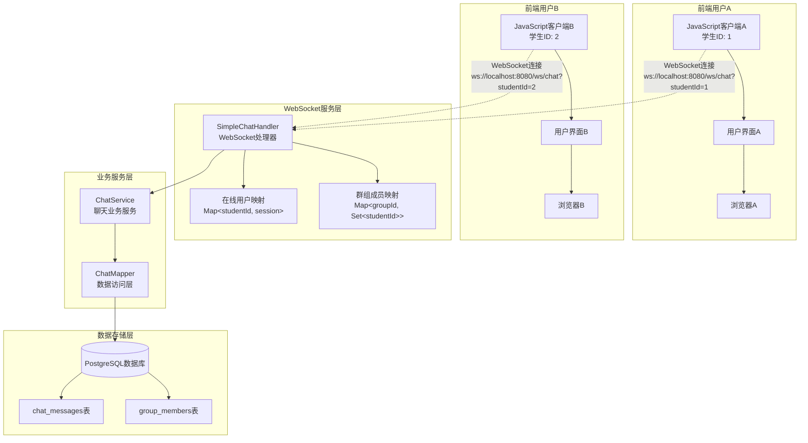
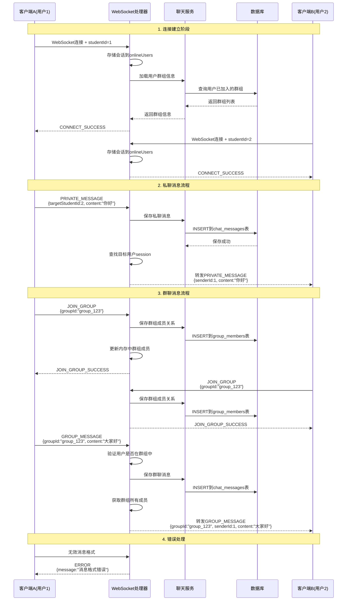
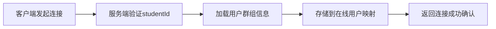
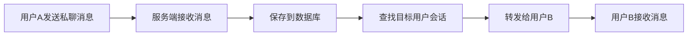
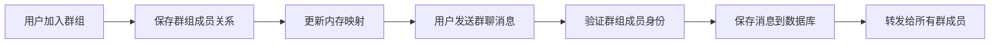
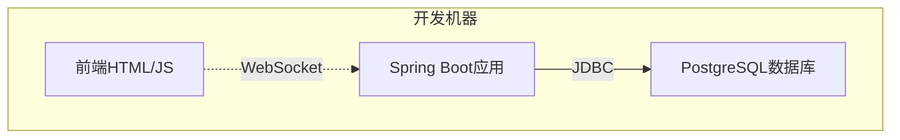
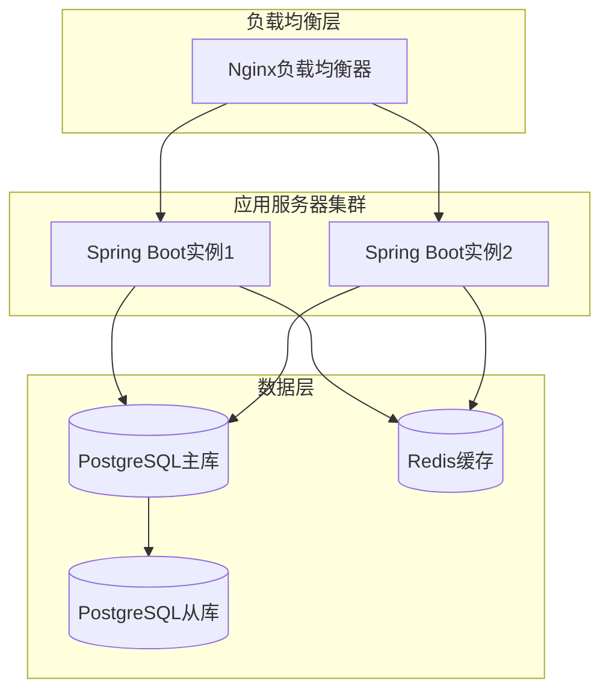

# 简化版实时聊天系统 - 前后端交互原理图

## 概述
本文档展示了基于WebSocket的简化版实时聊天系统的前后端交互架构和消息流程。

## 系统架构图

### 1. 整体系统架构

### 2. 详细交互流程图

## 核心组件说明

### 3.1 前端组件
- **JavaScript客户端**: 负责WebSocket连接管理和消息收发
- **用户界面**: 展示聊天消息和提供用户交互
- **浏览器**: 提供WebSocket API支持

### 3.2 后端组件
- **SimpleChatHandler**: WebSocket消息处理核心，管理连接和消息路由
- **ChatService**: 业务逻辑服务，处理消息存储and群组管理
- **ChatMapper**: 数据访问层，封装数据库操作
- **在线用户映射**: 内存中维护用户ID到WebSocket会话的映射
- **群组成员映射**: 内存中维护群组ID到成员列表的映射

### 3.3 数据存储
- **chat_messages表**: 存储所有聊天消息（私聊和群聊）
- **group_members表**: 存储群组成员关系

## 消息类型和流程

### 4.1 连接管理

### 4.2 私聊消息流程

### 4.3 群聊消息流程

## 技术特点

### 5.1 实时性
- 使用WebSocket协议实现真正的全双工通信
- 消息实时推送，无需轮询

### 5.2 可靠性
- 所有消息都持久化到数据库
- 完整的错误处理机制
- 连接断开后自动清理资源

### 5.3 扩展性
- 模块化设计，易于扩展新功能
- 统一的消息协议格式
- 支持水平扩展（可配合Redis等实现集群）

### 5.4 简洁性
- 只实现核心聊天功能
- 代码结构清晰，易于理解和维护
- 配置简单，部署方便

## 部署架构建议

### 6.1 开发环境

### 6.2 生产环境

## 安全考虑

### 7.1 当前实现
- 简单的studentId验证
- 基本的参数校验
- SQL注入防护（MyBatis）

### 7.2 生产环境建议
- 添加JWT令牌验证
- 实现用户权限控制
- 消息内容过滤
- 连接频率限制
- HTTPS/WSS加密传输

这个设计文档提供了完整的前后端交互原理图，有助于理解系统架构和开发实现。 